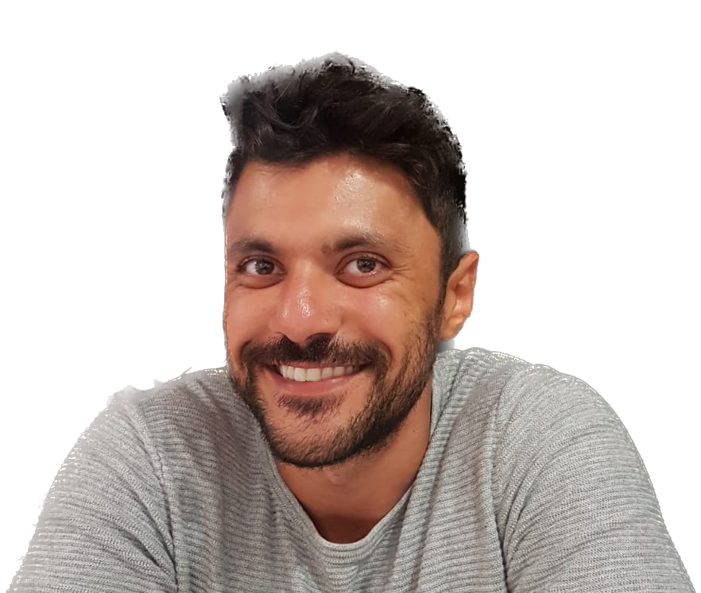

<h1>Software Developer</h1>

## About Me

Hello and welcome to my GitHub profile! My name is Omar Melloulchi aka <b>Omcci</b> I'm currently on a journey to pursue my passion for tech as a web developer, and I'm excited to share my progress with you.

After working as a coach and physical education teacher for several years, I realized that my true passion lies in the world of tech. I've always been drawn to the idea of creating something from scratch and watching it come to life, and that's what led me to embark on this new adventure.

## Project Showcase

As part of my training at the Wild Code School, I've already completed some exciting projects that I'm proud to share with you :

### Side project: Portfolio with React, TailwindCSS, ThreeJS

Description: This is a place where I can show you my work, mostly in web development for now.

GitHub repository link: https://github.com/Omcci/3DPortfolio

Live demo link: https://golden-flan-9015a5.netlify.app/

-------------------

### Project 2: Fitness App with React, Node, HTML, CSS, and JS

Description: This is a fitness app that fetches data from an API and allows users to track their workouts and progress. Created with React, Node, HTML, CSS, and JS for my Wild Code School Project 2. As a teamleader of the project we worked with scrum methods and sprints for each features. It was a great opportunity to combine my passion for fitness with my newfound love for tech. I'm excited about the potential of this app and how it could help people reach their fitness goals. 

GitHub repository link: https://github.com/Omcci/WCS-Projet2

Live demo link: https://astounding-gingersnap-8d73ac.netlify.app

Technology used:  
    
      

-------------------

### Project 1: Mario CV in CSS/HTML and JS

Description: This is a fictive CV for Mario created with CSS, HTML, and JS for my Wild Code School Project 1.
It was a fun challenge to bring a beloved video game character to life in a professional setting.
  

GitHub repository link: https://github.com/T0MLE/WCS-project1

Live demo link: SOON

SOON

Technology used:  
  
  
   

-------------------

## Looking Ahead

Currently, I'm still in the process of completing my Fullstack web developer training, with a focus on Javascript, React, NodeJS, mySQL, and Express. I'm eager to apply my experience and knowledge to my future career in tech.

As I move forward, I'm actively seeking an apprenticeship in a professional contract starting from September 2023. I'm excited to continue learning and growing as a developer, and I can't wait to see where this journey takes me.

Thank you for taking the time to read about me, and feel free to browse through my projects and contributions on GitHub. Let's connect and collaborate to make great things happen!

Click here to add me on 
